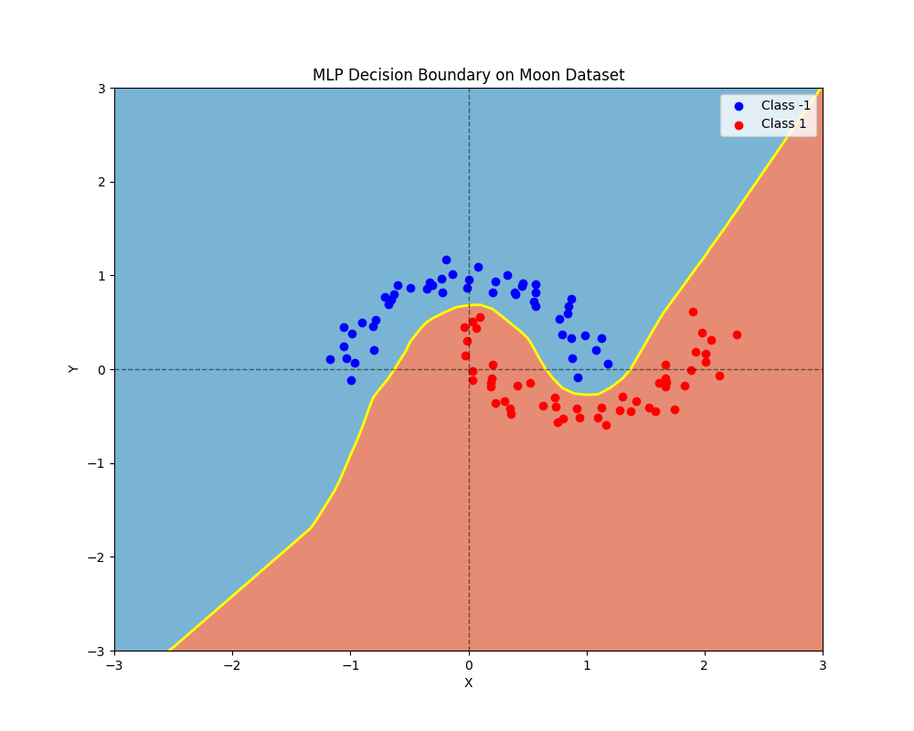

# *rust*-ograd

*port of [karpathy's micrograd](https://github.com/karpathy/micrograd)*

<div align="center">
<figure>
   
<br>
<figcaption>Training Process</figcaption>
</figure>
</div>

A tiny autograd engine. Implements backpropagation (reverse mode autodiff) over a dynamically built DAG and a small neural
networks library built on top of it with a PyTorch-like API. The DAG only operates over scalar values,
so e.g. we chop up each neuron into all of its individual tiny adds and muls.
However, this is enough to build up entire deep neural nets doing binary classification.

## Example usage

```rust
use rustograd::ValueWrapper;

let a = ValueWrapper::new(-4.0);
let b = ValueWrapper::new(2.0);

let mut c = a.clone() + b.clone();
let mut d = a.clone() * b.clone() + b.clone().pow(3.0);

c += c.clone() + 1.0;
c += 1.0 + c.clone() + (-a.clone());
d += d.clone() * 2.0 + (b.clone() + a.clone()).relu();
d += 3.0 * d.clone() + (b.clone() - a.clone()).relu();

let e = c - d;
let f = e.pow(2.0);
let mut g = f.clone() / 2.0;
g += 10.0 / f;

println!("{:.4}", g.0.borrow().data); // prints 24.7041, the outcome of this forward pass

g.backward();

println!("{:.4}", a.0.borrow().grad); // prints 138.8338, i.e. the numerical value of dg/da
println!("{:.4}", b.0.borrow().grad); // prints 645.5773, i.e. the numerical value of dg/db
```

## Training a neural net

This [program](src/main.rs) provides a full demo of training a 2-layer neural network (MLP)
binary classifier. This is achieved by initializing a neural net from `rustograd::nn` module,
implementing a simple svm "max-margin" binary classification loss and using SGD for optimization.
As shown in the program, using a 2-layer neural net with 16-node hidden layers we achieve the following 
decision boundary on the moon dataset:

<div align="center">
<figure>
   
<br>
<figcaption>Decision Boundary</figcaption>
</figure>
</div>

## Running tests

To run the units tests, execute `cargo test` in the root directory of the repo.
Currently the tests use hardcoded reference values, might update in the future to add some python bindings and use pytorch directly
to compute the reference values.

## License

MIT