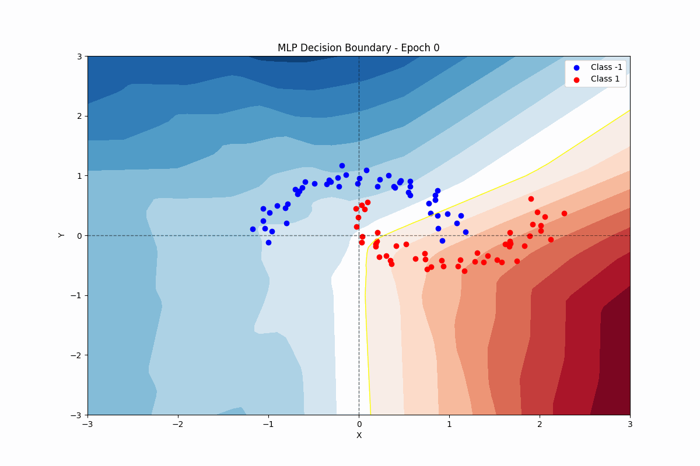

# *rust*-ograd

<textarea style="width: 100%; height: 100px; resize: none; font-size: 1.5em; text-align: center; color: #000000; background-color: #ffffff; border: 0px; outline: none; cursor: default;">Training process</textarea>

